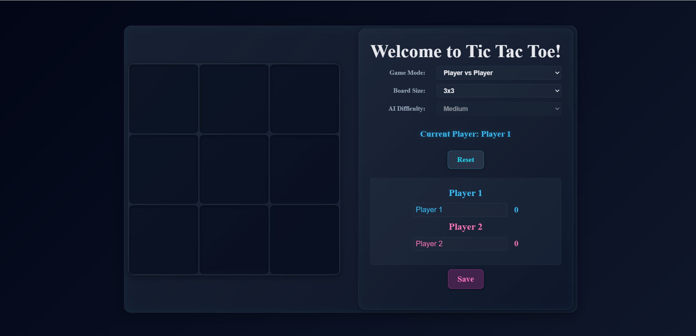
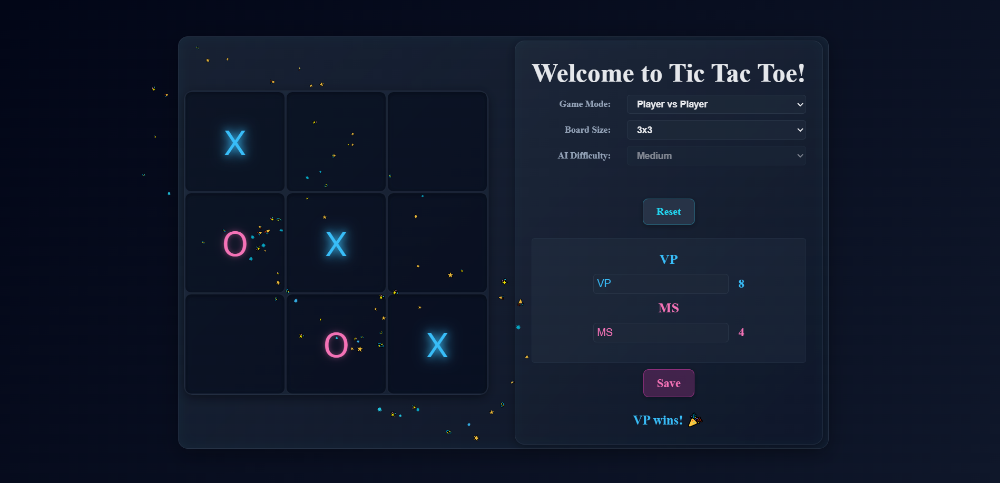
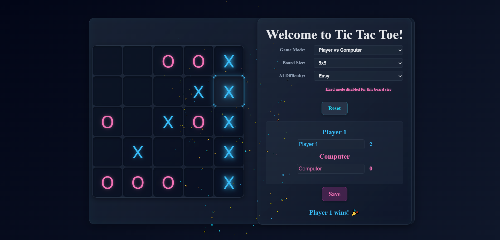

# 🎮 Tic Tac Toe – Scalable Web Game with AI

A modern, interactive **Tic Tac Toe web application** built using **HTML, CSS, and Vanilla JavaScript**, featuring dynamic board sizes, AI-powered gameplay, animated winning logic, persistent score tracking, and an elegant glassmorphism UI.

---

## 📌 Table of Contents

- [✨ Features](#-features)
- [📸 Screenshots](#-screenshots)
- [🛠️ Tech Stack](#️-tech-stack)
- [📦 Installation](#-installation)
- [🚀 Usage](#-usage)
- [🎨 UI--ux-highlights](#-ui--ux-highlights)
- [🧠 Game Logic Overview](#-game-logic-overview)
- [💾 Persistent Storage](#-persistent-storage)
- [🗂️ Project Structure](#️-project-structure)
- [🔐 Accessibility & Quality](#-accessibility--quality)
- [📚 What I Learned](#-what-i-learned)
- [🚢 Deployment](#-deployment)
- [📄 License](#-license)
- [👨‍💻 Author](#-author)

---

## ✨ Features

### 🎯 Core Features
- **Multiple Game Modes** – Player vs Player (PvP) & Player vs Computer (PvC)
- **Dynamic Board Sizes** – 3×3, 4×4, and 5×5 boards
- **AI Opponent** – Easy, Medium, and Hard difficulty levels
- **Minimax Algorithm** – Optimal AI gameplay for 3×3 board
- **Animated Winning Line** – SVG-based animated strike-through
- **Persistent Scores** – Saved using LocalStorage
- **Keyboard Accessibility** – Play using keyboard controls
- **Sound Effects** – Move, win, draw, and UI sounds

### 🤖 AI Features
- **Easy Mode** – Random valid moves
- **Medium Mode** – Defensive and winning strategies
- **Hard Mode** – Minimax algorithm (3×3 only)
- Automatic handling of unsupported AI modes for larger boards

---

## 📸 Screenshots

> Screenshots showing gameplay, winning states, and settings UI.

---

## 🛠️ Tech Stack

### Frontend
- **HTML5** – Semantic structure
- **CSS3** – Grid, animations, glassmorphism UI
- **Vanilla JavaScript** – Game logic and state management
- **SVG** – Precise animated winning lines
- **LocalStorage API** – Persistent state

### Audio
- **HTML5 Audio API**
- Custom sound effects for interactions

---

## 📦 Installation

### Prerequisites
- Any modern web browser (Chrome, Edge, Firefox)
- No frameworks or server required

### Steps
~~~bash
git clone https://github.com/your-username/tic-tac-toe-ai.git
cd tic-tac-toe-ai
~~~

Open **`index.html`** directly in your browser.

---

## 🚀 Usage

### Getting Started
1. Open the game in your browser
2. Select game mode (PvP / PvC)
3. Choose board size and AI difficulty
4. Enter player names
5. Start playing immediately

### 🎮 Controls
- **Mouse Click** – Place move
- **Keyboard**
  - **Enter / Space** – Place move
  - **1–9 keys** – Quick input for 3×3 board
- **Reset Button** – Reset board and scores

---

## 🎨 UI & UX Highlights

- Glassmorphism-inspired dark theme
- Player-based neon color system (X & O)
- Hover previews for move placement
- Smooth animations and transitions
- Fully responsive layout
- Accessible UI with keyboard support

---

## 🧠 Game Logic Overview

- Centralized game state management
- Scalable win-detection logic for N×N boards
- SVG-based calculation of exact winning line positions
- Minimax algorithm with depth-based scoring
- Automatic draw detection
- Event-driven UI updates

---

## 💾 Persistent Storage

Stored using **LocalStorage**:
- Player names
- Scores
- Game mode and board size
- AI difficulty level

State persists across page reloads.

---

## 🗂️ Project Structure

~~~text
tic-tac-toe/
├── screenshots/
│   ├── game-board.png
│   ├── win-line.png
│   ├── ai-mode.png
│
├── index.html        # Main HTML structure
├── style.css         # Styling and animations
├── script.js         # Game logic and AI
│
├── gameball.wav
├── click.wav
├── claps.mp3
├── aww.mp3
├── little-bell.mp3
│
└── README.md
~~~

---

## 🔐 Accessibility & Quality

- Keyboard-navigable gameplay
- Focus-visible UI elements
- ARIA-friendly structure
- No external dependencies
- Clean separation of logic and UI

---

## 📚 What I Learned

- Implementing game algorithms in UI-driven applications
- Writing scalable JavaScript logic without frameworks
- SVG rendering and animation handling
- Improving accessibility and keyboard usability
- Managing persistent state in frontend apps

---

## 🚢 Deployment

This project can be deployed on:
- **GitHub Pages**
- **Netlify**
- **Vercel**

Upload the static files and set `index.html` as the entry point.

---

## 📄 License

This project is licensed under the **MIT License**.

---

## 👨‍💻 Author

**Vedansh Pandey**  
Built with ❤️ using modern frontend best practices.
